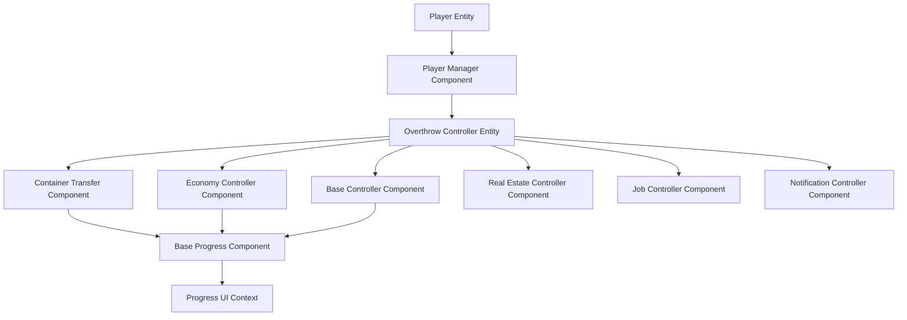
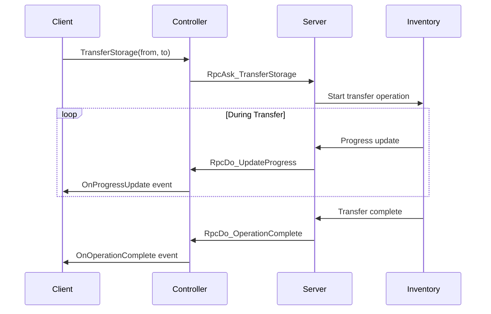
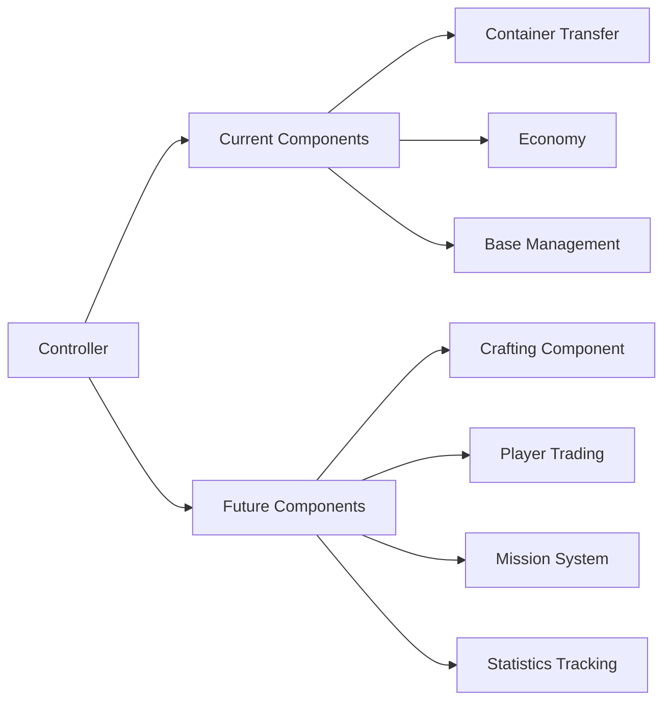

# Overthrow Controller Architecture Design

## Overview

The Overthrow Controller system introduces a new modular architecture to replace the current monolithic `OVT_PlayerCommsComponent`. Instead of routing all server communication through a single component, each player will own a dedicated controller entity with specialized components for different features.

## Current vs New Architecture

### Current Problems
- **Single Point of Congestion**: All server communication through `OVT_PlayerCommsComponent`
- **Monolithic Design**: One component handles economy, bases, inventory, and more
- **Limited Extensibility**: New features require modifying the same component
- **Poor Separation of Concerns**: Mixed domains in one place
- **Difficult Testing**: Can't test features in isolation

### New Architecture Benefits
- **Modular Components**: Dedicated components for each feature
- **Better Organization**: Clear separation of concerns
- **Easier Testing**: Independent component testing
- **Network Efficiency**: Only relevant data replication
- **Type Safety**: Strongly-typed component interfaces
- **Progress Tracking**: Built-in support for long-running operations

## System Architecture



## Core Components

### OVT_OverthrowController
The main controller entity owned by each player, spawned when they join the server.

**Key Features:**
- Houses all player-specific components
- Automatically cleaned up on player disconnect
- Networked entity with proper replication

### OVT_BaseServerProgressComponent
Base class for any server operation requiring progress tracking.

**Functionality:**
- Progress tracking (percentage, items processed, current operation)
- Client-side progress callbacks
- Error handling and reporting
- Operation state management

**Progress Events:**
- `OnProgressUpdate(progress, current, total, operation)`
- `OnOperationComplete(itemsTransferred, itemsSkipped)`
- `OnOperationError(errorMessage)`

### OVT_ContainerTransferComponent
Handles all container transfer operations with real-time progress updates.

**Core Operations:**
- **Transfer Storage**: Move items between two containers
- **Collect Containers**: Gather containers from an area to a vehicle
- **Transfer to Warehouse**: Move items to faction warehouse

**Features:**
- Batch processing for large transfers
- Configurable operation parameters
- Real-time progress reporting
- Error handling and recovery

## Container Transfer Flow



## Client Access Pattern

The system provides convenient access through `OVT_Global`:

```cpp
// Get specific component
OVT_ContainerTransferComponent transfer = OVT_Global.GetContainerTransfer();

// Use component
transfer.TransferStorage(fromEntity, toEntity);
transfer.CollectContainers(position, vehicle, radius);
```

## Migration Path

**Before:**
```cpp
OVT_PlayerCommsComponent comms = OVT_Global.GetServer();
comms.TransferStorage(from, to);
```

**After:**
```cpp
OVT_ContainerTransferComponent transfer = OVT_Global.GetContainerTransfer();
transfer.TransferStorage(from, to);
```

## Implementation Phases

### Phase 1: Foundation ✅
- Controller prefab and spawning system
- Basic controller lifecycle management
- Integration with PlayerManager

### Phase 2: Progress Infrastructure
- Base progress component implementation
- Progress tracking and reporting
- UI integration for progress display

### Phase 3: Container Transfer
- Container transfer component
- Integration with inventory system
- FOB deployment/undeployment migration

### Phase 4: Full Migration
- Migrate remaining operations from PlayerCommsComponent:
  - Economy operations (money, shops)
  - Base management (garrisons, capture)
  - Real estate (homes, buildings)
  - Job management
  - Notifications
- Deprecate PlayerCommsComponent

## Future Expansion

The modular design enables easy addition of new functionality:



## Container Transfer Benefits

The new system specifically improves container operations:

- **Real-time Progress**: Live updates during transfers
- **Batch Processing**: Efficient handling of large operations
- **Error Recovery**: Proper error reporting and handling
- **Operation Control**: Ability to cancel or pause operations
- **Queue Management**: Multiple concurrent transfers
- **UI Integration**: Built-in progress dialog support

## Security & Performance

**Security Measures:**
- Player ownership validation
- Server-side request validation
- Rate limiting for expensive operations
- Automatic cleanup on disconnect

**Performance Optimizations:**
- Batch processing for large transfers
- Configurable operation parameters
- Efficient network replication
- Progress throttling to prevent spam

## Summary

The Overthrow Controller architecture transforms the current monolithic system into a modular, extensible framework. By separating concerns into dedicated components and providing robust progress tracking, the system becomes more maintainable, testable, and user-friendly while maintaining security and performance standards.